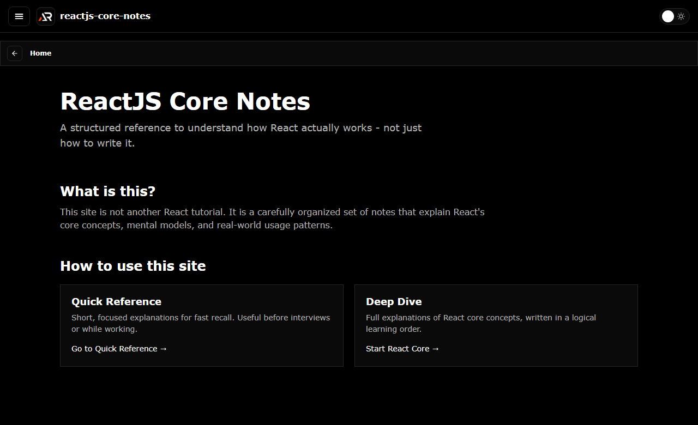

# ReactJS Core Notes

A structured Vite reference for React fundamentals, practical examples, and interview preparation.

## What is included

- JSX, components, props, state, and rendering
- Hooks, effects, events, forms, lists, and keys
- Styling, performance, routing, and component architecture
- React interview questions grouped by topic
- Theme toggle, searchable navigation, and route-aware notes

## Tech stack

React, Vite, React Router, styled-components, Material UI, and React Icons.

## Run locally

~~~bash
npm install
npm run dev
~~~

Build and deploy:

~~~bash
npm run build
npm run deploy
~~~

## Links

- Live: [https://a2rp.github.io/reactjs-core-notes/](https://a2rp.github.io/reactjs-core-notes/)
- Repository: [https://github.com/a2rp/reactjs-core-notes](https://github.com/a2rp/reactjs-core-notes)
- Portfolio: [https://www.ashishranjan.net/](https://www.ashishranjan.net/)
- GitHub: [https://github.com/a2rp](https://github.com/a2rp)
- CodePen: [https://codepen.io/ash1198](https://codepen.io/ash1198)
- LinkedIn: [https://www.linkedin.com/in/aashishranjan](https://www.linkedin.com/in/aashishranjan)
- Facebook: [https://www.facebook.com/theash.ashish/](https://www.facebook.com/theash.ashish/)
- YouTube: [https://www.youtube.com/@ashishranjan-ashz?sub_confirmation=1](https://www.youtube.com/@ashishranjan-ashz?sub_confirmation=1)
- Email: [ash.ranjan09@gmail.com](mailto:ash.ranjan09@gmail.com)

## Support

- [Support](https://a2rp-donation-page.netlify.app/)
- [Buy Me a Coffee](https://buymeacoffee.com/a2rp)
- [Patreon](https://patreon.com/a2rp)
